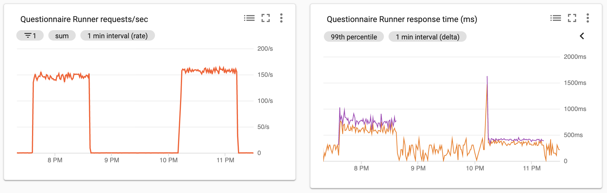

# Update to Python 3.8

Following gevent now supporting Python 3.8 (as of gevent 1.5) we are now able to upgrade Python.
There will be performance implications with both Python 3.8 and the gunicorn/gevent libraries.

https://github.com/ONSdigital/eq-questionnaire-runner/tree/update-to-python-38

## Benchmark version

| Tag | Identifying Commit |
|--------|-------|
| latest | 7c865648ad1665583ee0a6a1738e5a4a70e28f80 |

## Benchmark profile

| Option | Value |
|--------|-------|
| Requests file | census_household_gb_eng.json |
| Run time | 60 mins |
| Instances | 1 |
| User wait time minimum | 1 |
| User wait time maximum | 2 |
| Clients | 100 |
| Hatch rate | 100 |

## Runner images
| Type      | Tag    | Commit | Date |
|-----------|--------|--------|------|
| Baseline  | latest  | 4bd042ae1e1ab75f4f4f377c0a26a9124ba30207 | Tue May 5 12:51:10 2020 +0100 |
| Investigation Candidate | update-to-python-38 | 29ddee54edfc60d0ee7ecc04944911e21bb6c4dd | Tue May 5 09:41:30 2020 +0100 |

## Results

Results based on 99th percentile timings and under the test conditions as detailed above in the benchmark profile.

| Metric | Baseline | Investigation |
|--------|----------|--------------|
| Questionnaire GETs | 587 | 393 |
| Questionnaire POSTs | 730 | 431 |
| All requests | 690 | 380 |

## Supporting Observations

## Decision

The observed performance gains during testing indicate a merge of this branch would be beneficial.
It should be noted, however, that the gains observed under the testing conditions in the above benchmark profile should not be taken as a headline performance improvement of 'x' percent.
While the above benchmark profile was intended to represent a realistic top end load, further testing of the candidate branch yielded a range of performance gains not all as significant as documented here. It was observed that at lower loads the performance gains were reduced.
