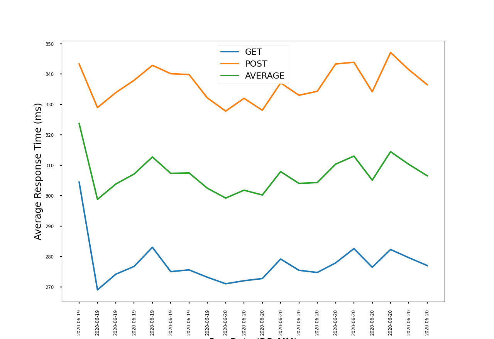

# Replacement of Flask Caching with Built-in functools caching

An improvement in Datastore latencies was seen coinciding with the replacement of Flask caching with Python 3.8 built-in functools caching. 
This test was carried out to help understand if these gains were coincidental or whether there is potentially some bottlenecks in the way we initialise the Datastore client.

The tests documented here are like-for-like with our daily performance tests.

## Benchmark version

| Tag | Commit |
|--------|-------|
| latest | 8f2b9fe14eb19e19140f18b0e5bee78f4dbcb1af |

## Benchmark profile

| Option | Value |
|--------|-------|
| Requests file | census_household_gb_eng.json |
| Run time | 60 mins |
| Instances | 1 |
| User wait time minimum | 1 |
| User wait time maximum | 2 |
| Clients | 64 |
| Hatch rate | 64 |

## Runner images
| Type      | PR    | Commit |  Date | Comments |
|-----------|--------|--------|--------|--------|
| Baseline  | https://github.com/ONSdigital/eq-questionnaire-runner/pull/140  | cdf61f7290b62e97a901ed5bbb1396700d2c4494 | Tue 09, Jun 2020 10:15 UTC | Commit in which Flask caching was removed |
| Investigation Candidate | https://github.com/ONSdigital/eq-questionnaire-runner/pull/141 | d4cdb5040dc0fc77270038b3af6e17a205ea077e | Mon 08, Jun 2020 07:52 UTC | Last commit before Flask caching/werkzeug cached_property was removed |

## Results

### Locust

Results are based on the 99th percentile timings and under the test conditions as detailed above in the benchmark profile.
The tests were repeated multiple times to verify the results. These results are averages between all the tests.

| Metric | Baseline | Investigation |
|--------|----------|--------------|
| Questionnaire GETs | 100 | 277 |
| Questionnaire POSTs | 121 | 337 |
| All requests | 110 | 307 |

### Datastore Metrics

Datastore's read/writes metrics for a single test run. These metrics were consistent between tests.

| Metric | Baseline | Investigation |
|--------|----------|--------------|
| Reads per second | 115 | 105 |
| Writes per second| 55 | 50 |

#### Datastore Latency reported by New Relic

Top 3 most time-consuming routes. These are averages between all test runs.

| Route (avg % time spent) | Baseline | Investigation |
|--------|----------|--------------|
| app.routes.questionnaire.block (93%) | 20.5ms | 34.4ms |
| app.routes.questionnaire.get_questionnaire (2%)| 12.3ms | 20.5ms |
| app.routes.questionnaire.post_questionnaire (2%) | 17.7ms | 28.9ms |

## Supporting Observations

### Baseline

### Investigation

## Conclusion

The observed performance loss during testing with the investigation candidate indicates there could potentially be some bottleneck/issue with
the way we currently setting up the Datastore client. Therefore, an investigation should be carried out to identify the cause of this issue.
