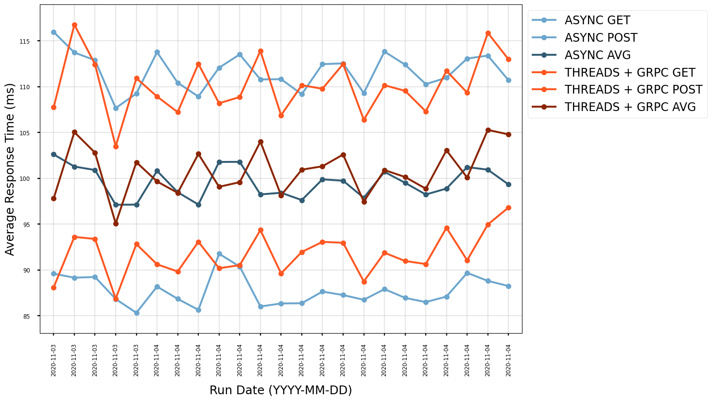

# Use gthread gunicorn worker class and gRPC protocol #2

This document follows on from the [previous test](https://github.com/ONSdigital/eq-survey-runner-benchmark/blob/main/doc/performance-investigations/0008-use-gthread-grpc/summary.md) that was carried out to investigate the performance of the threaded worker class of Gunicorn with and without gRPC.
Now that sessions are stored in Datastore instead of Redis, a re-run of the previous test was appropriate.

## Benchmark profile

| Option                 | Value                        |
|------------------------|------------------------------|
| Requests file          | census_household_gb_eng.json |
| Run time               | 30m                          |
| User wait time minimum | 1                            |
| User wait time maximum | 2                            |
| Clients                | 64                           |
| Hatch rate             | 64                           |
| Number of workers      | 7                            |
| Number of threads      | 7                            |

This test replicates the current settings for the daily test.

The version of runner tested: https://github.com/ONSdigital/eq-questionnaire-runner/releases/tag/v3.53.0

## Results

The tests were run multiple times to ensure the performance was consistent; however, I have only included a single sample per configuration in the outputs.
The results below are the averages between all tests. Note response times are in milliseconds.

|                          | Request Count | Failure Count | Median Response Time | Average Response Time | Min Response Time | Max Response Time | Average Content Size | Requests/s |
|--------------------------|---------------|---------------|----------------------|-----------------------|-------------------|-------------------|----------------------|------------|
| Gunicorn Async           | 207261        | 0             | 52                   | 54.94                 | 21.93             | 716.75            | 9763.80              | 115.56     |
| Gunicorn Threads         | 202737        | 0             | 60                   | 65.43                 | 23.99             | 1464.30           | 9760.59              | 113.39     |
| Gunicorn Threads + gRPC  | 209122        | 0             | 50                   | 53.77                 | 21.75             | 766.09            | 9764.12              | 115.77     |

|                          | 50% | 66% | 75% | 80% | 90% | 95% | 98% | 99% | 99.90% | 99.99% | 100% |
|--------------------------|-----|-----|-----|-----|-----|-----|-----|-----|--------|--------|------|
| Gunicorn Async           | 52  | 58  | 61  | 64  | 72  | 82  | 97  | 120 | 200    | 350    | 720  |
| Gunicorn Threads         | 60  | 67  | 72  | 77  | 92  | 110 | 140 | 160 | 250    | 450    | 1500 |
| Gunicorn Threads + gRPC  | 50  | 55  | 59  | 62  | 72  | 83  | 100 | 120 | 190    | 350    | 770  |

|                          | GETs Response Time | POSTs Response Time| All requests Response Time | 
|--------------------------|--------------------|--------------------|----------------------------|
| Gunicorn Async           | 87                 | 111                | 99                         |
| Gunicorn Threads         | 137                | 162                | 150                        |
| Gunicorn Threads + gRPC  | 91                 | 110                | 100                        |

#### Performance comparison of Async vs Thread with gRPC over multiple tests

Threads without gRPC is not included as it was not performant enough

## Observations

- Threads with gRPC was as performant as async
- Using threads is only feasible when also using gRPC

## Decision
- Given the performance of Gunicorn threads with gRPC is on par with async gevent and the options it opens up, we should use threads with gRPC
- Look at the impact of varying the number of threads
- Test uWSGI threads with gRPC
- Run a scale test to discover how threads with gRPC behaves under higher load.
