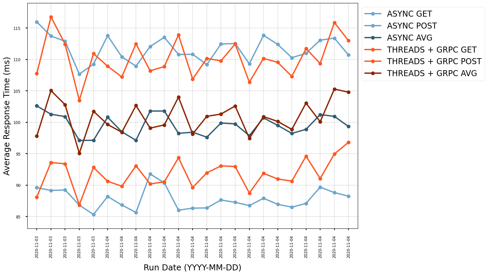

# Web server worker class: Async vs Threads vs Threads + gRPC

We have only ever run the application with Gunicorn in async mode (workers). We should try threads if it is more performant, reliable or consistent. 
Using threads also opens up other options:
 - the ability to use gRPC for Datastore which is potentially more performant than HTTP
 - the ability to use other Google libraries such as Pub/Sub which current is only performant under threads

## Benchmark profile

| Option                 | Value                        |
|------------------------|------------------------------|
| Requests file          | census_household_gb_eng.json |
| Run time               | 30m                          |
| User wait time minimum | 1                            |
| User wait time maximum | 2                            |
| Clients                | 64                           |
| Hatch rate             | 64                           |
| Number of workers      | 7                            |
| Number of threads      | 7                            |

This test replicates the current settings for the daily test.

The version of runner tested: https://github.com/ONSdigital/eq-questionnaire-runner/releases/tag/v3.53.0

## Results

The tests were run multiple times to ensure the performance was consistent; however, I have only included a single sample per configuration in the outputs.
The results below are the averages between all tests. Note response times are in milliseconds.

|                          | Request Count | Failure Count | Median Response Time | Average Response Time | Min Response Time | Max Response Time | Average Content Size | Requests/s |
|--------------------------|---------------|---------------|----------------------|-----------------------|-------------------|-------------------|----------------------|------------|
| Gunicorn Async           | 207261        | 0             | 52                   | 54.94                 | 21.93             | 716.75            | 9763.80              | 115.56     |
| Gunicorn Threads         | 202737        | 0             | 60                   | 65.43                 | 23.99             | 1464.30           | 9760.59              | 113.39     |
| Gunicorn Threads + gRPC  | 209122        | 0             | 50                   | 53.77                 | 21.75             | 766.09            | 9764.12              | 115.77     |

|                          | 50% | 66% | 75% | 80% | 90% | 95% | 98% | 99% | 99.90% | 99.99% | 100% |
|--------------------------|-----|-----|-----|-----|-----|-----|-----|-----|--------|--------|------|
| Gunicorn Async           | 52     | 58  | 61     | 64  | 72  | 82  | 97  | 120 | 200    | 350    | 720  |
| Gunicorn Threads         | 60     | 67  | 72  | 77  | 92     | 110 | 140 | 160 | 250    | 450    | 1500 |
| Gunicorn Threads + gRPC  | 50     | 55  | 59     | 62  | 72  | 83  | 100 | 120 | 190   | 350   | 770  |

|                          | GETs Response Time | POSTs Response Time| All requests Response Time | 
|--------------------------|--------------------|--------------------|----------------------------|
| Gunicorn Async           | 87                 | 111                | 99                        |
| Gunicorn Threads         | 137                | 162                | 150                        |
| Gunicorn Threads + gRPC  | 91                 | 110                | 100                         |

Performance comparison of Async vs Thread with gRPC over multiple tests.

I didn't include threads without gRPC since it was not performant enough to be considered.

## Observations

- Threads with gRPC is just as performant as async
- Using threads is only feasible when also using gRPC

## Decision
- Given the performance of Gunicorn threads with gRPC is on par with async gevent and the options it opens up, we should use threads with gRPC
- Look at the impact of varying the number of threads
- Test uWSGI threads with gRPC
