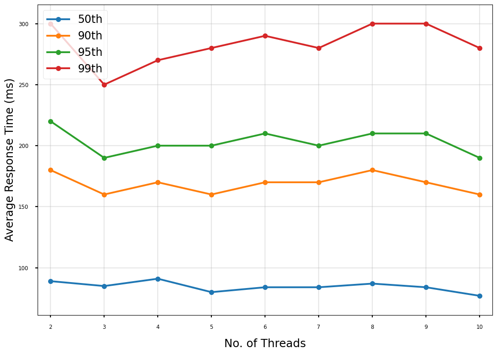
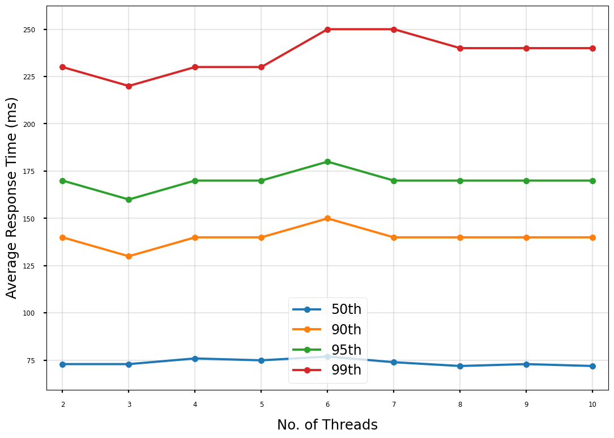
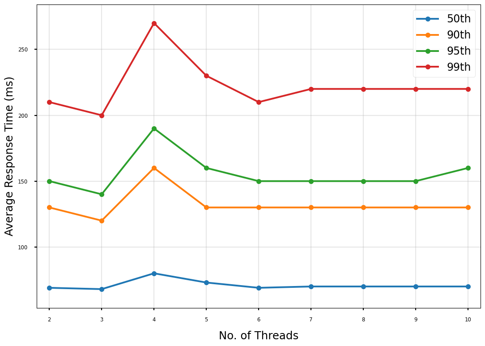
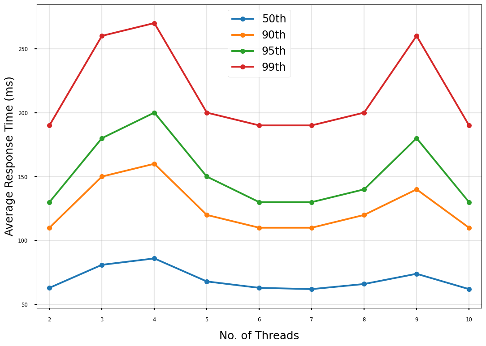
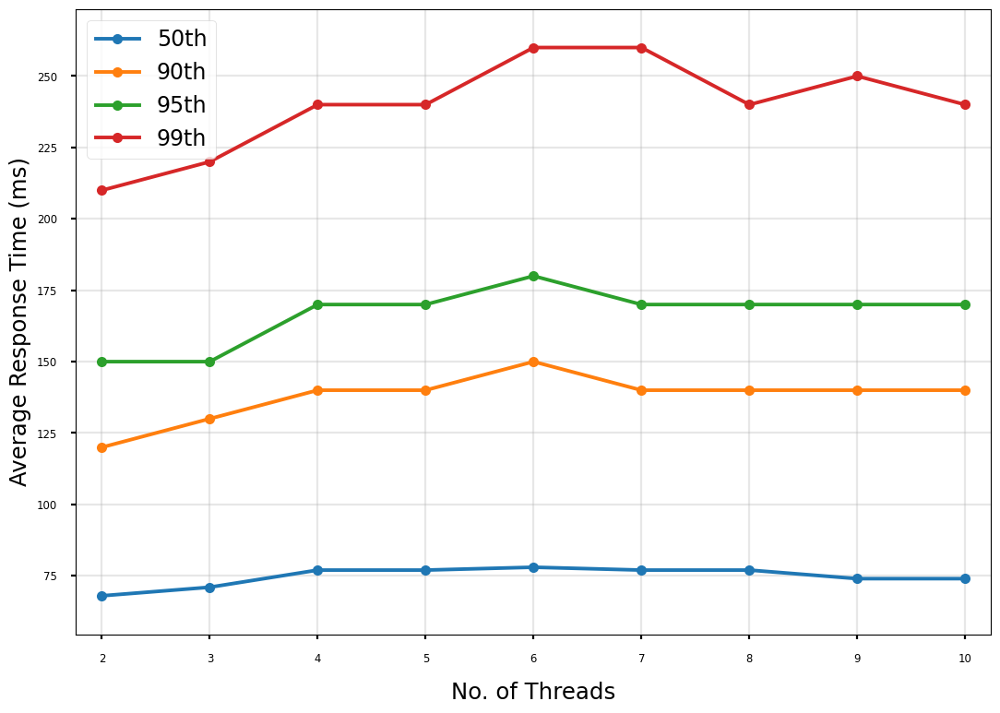
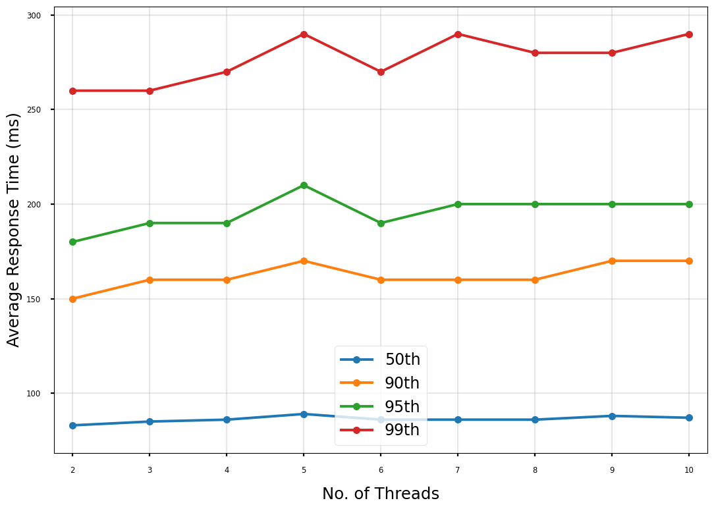
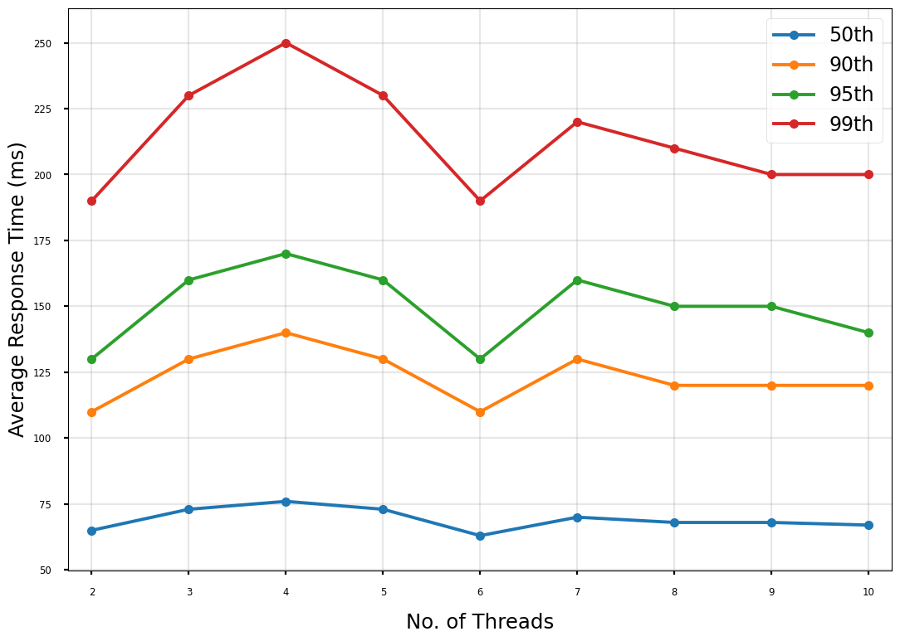
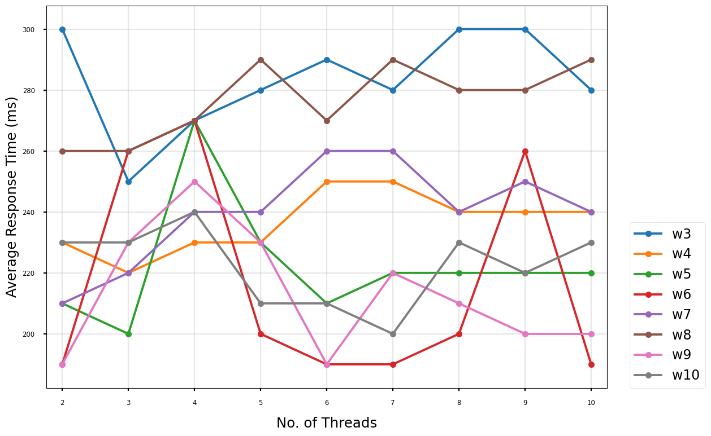

# Gunicorn worker and thread count configuration

Questionnaire runner currently uses the formula `(2 x $num_cores) + 1` when configuring the number of Gunicorn workers and threads. This results in 7 workers by 7 threads for our current vCPU count of 3.
This document highlights the results from running the application with different numbers of workers and thread permutations. Both workers and threads ranged from 1 to 10. 

## Benchmark profile

| Option                             | Value                        |
|------------------------------------|------------------------------|
| Requests file                      | census_household_gb_eng.json |
| Run time                           | 20m                          |
| User wait time minimum             | 1                            |
| User wait time maximum (exclusive) | 3                            |
| Clients                            | 225                          |
| Hatch rate                         | 225                          |
| number of workers                  | 1 to 10                      |
| number of threads                  | 1 to 10                      |
| Questionnaire Runner version       | v3.56.0                      |

A client rate of 225 was chosen to achieve ~65/70% CPU usage. Prior to the 20 minute test, a 1 minute warm up test was run to reduce any cold start times.

## Results

The table below compares the current configuration of 7 workers by 7 threads with the top-performing permutations.

| Worker x Thread | 50th Percentile | 90th Percentile | 95th Percentile | 99th Percentile | 99.9th Percentile | 100th Percentile | GETs Average (weighted) | POSTs Average (weighted) | All requests Average (weighted) | Total Requests |
|-----------------|-----------------|-----------------|-----------------|-----------------|-------------------|------------------|-------------------------|--------------------------|---------------------------------|----------------|
| 7 x 7 (Current) | 77              | 140             | 170             | 260             | 600               | 1400             | 243                     | 298                      | 270                             | 320,773        |
| -               | -               | -               | -               | -               | -                 | -                | -                       | -                        | -                               | -              |
| 5 x 2           | 69              | 130             | 150             | 210             | 280               | **510**          | 189                     | 208                      | 198                             | 325,105        |
| 5 x 3           | 68              | 120             | 140             | 200             | **270**           | 650              | 174                     | 200                      | 187                             | 326,242        |
| 5 x 6           | 69              | 130             | 150             | 210             | 300               | 610              | 182                     | 220                      | 201                             | 324,880        |
| 5 x 8           | 70              | 130             | 150             | 220             | 310               | 550              | 181                     | 225                      | 203                             | 324,731        |
| 5 x 10          | 70              | 130             | 160             | 220             | 320               | 610              | 189                     | 234                      | 211                             | 324,585        |
| 6 x 2           | 63              | **110**         | **130**         | **190**         | **270**           | 770              | 168                     | 186                      | 177                             | 328,819        |
| 6 x 5           | 68              | 120             | 150             | 200             | 290               | 580              | 172                     | 212                      | 191                             | 326,306        |
| 6 x 6           | 63              | **110**         | **130**         | **190**         | 280               | **510**          | 159                     | 195                      | 177                             | 328,715        |
| 6 x 7           | **62**          | **110**         | **130**         | **190**         | **270**           | 1400             | **157**                 | 192                      | **174**                         | 328,855        |
| 6 x 8           | 66              | 120             | 140             | 200             | 300               | 570              | 169                     | 207                      | 188                             | 326,849        |
| 6 x 10          | **62**          | **110**         | **130**         | **190**         | 280               | 630              | 159                     | 195                      | 176                             | **329,017**    |
| 7 x 2           | 68              | 120             | 150             | 210             | 300               | 730              | 199                     | 214                      | 206                             | 325,552        |
| 9 x 2           | 65              | **110**         | **130**         | **190**         | **270**           | 700              | 168                     | **190**                  | 179                             | 328,011        |
| 9 x 6           | 63              | **110**         | **130**         | **190**         | 280               | 560              | 160                     | 196                      | 178                             | 328,588        |
| 9 x 9           | 68              | 120             | 150             | 200             | 300               | 740              | 172                     | 213                      | 192                             | 326,285        |
| 9 x 10          | 67              | 120             | 140             | 200             | 300               | 580              | 172                     | 214                      | 193                             | 326,015        |
| 10 x 7          | 65              | 120             | 140             | 200             | 310               | 660              | 172                     | 212                      | 192                             | 326,886        |
| 10 x 10         | 73              | 130             | 160             | 230             | 340               | 620              | 196                     | 246                      | 221                             | 323,284        |

- There were 0 failures for these configurations.

### Performance comparison of thread counts

The following results were omitted because the 99th percentile response was above 500ms:
1. All workers with a thread count of 1
2. All permutations of 1 and 2 workers.

#### Workers: 3

#### Workers: 4

#### Workers: 5

#### Workers: 6

#### Workers: 7

#### Workers: 8

#### Workers: 9

#### Workers: 10

#### Comparison of the 99th percentile between worker and thread counts

## Observations

- Using a thread count of 1 or worker count of 1/2 is not feasible.
- Our current configuration of 7 workers by 7 threads is not the most optimal.

## Decision
- Since different configuration has different pros and cons for different percentiles a few different worker/thread configurations may need further testing.
- Run a scale test to discover how these new configurations compare at higher loads.
