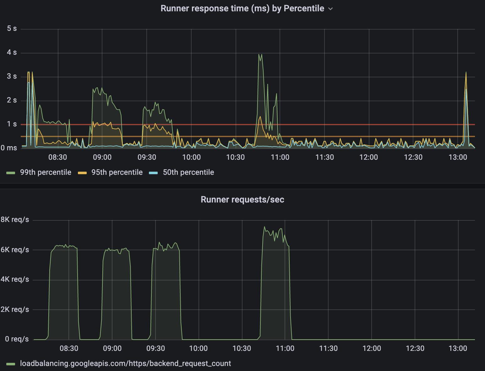

# Stress Test Phase 3 January 2022

Following successful Phase 2 Performance testing we need to run a stress test to identify the point of failure at 50 runner instances.

## Runner settings

| Setting | Value |
| --- | ---| 
| Concurrency | 115 |
| Max instances   | 50 |
| Min instances | 50 |
| CPU | 4 |
| Memory | 4G |
| Version | 3.94.0 |

## Benchmark settings

| Setting | Value |
| --- | ---| 
| Clients per instance | 100 |
| Clients hatch rate   | 50 |
| Wait time minimum | 1 |
| Wait time maximum | 2 |
| Requests JSON | test_benchmark_business.json |
| Runtime | 20m |

## Initial Benchmark

Ran an initial benchmark against 40 load injector instances to check that the results were comparable with the phase 2 test.

The result was broadly comparable but slightly faster for the phase 3 test. 

| Stress Test | Runner Concurrency |Runner Instances | Run Time| Clients per instance | Requests per second | 99th percentile Max CPU Usage (%) | 99th percentile response time (ms) | Error rate (%) | Output |
| --- | --- | --- | --- |--- | --- | --- | --- | --- | --- |
| Phase 2 | 115 | 50 | 20 mins | 100  | 4668 | 64.5 | 229 | 0.000 | [output](https://console.cloud.google.com/storage/browser/eq-stress-injector-07122021-outputs/stress-test/2021-12-29T14:42:36) |
| Phase 3 | 115 | 50 | 20 mins | 100  | 4668 |  61.5 | 167 | 0.000 | [output](https://console.cloud.google.com/storage/browser/eq-stress-injector-07122021-outputs/stress-test/2022-01-28T10:26:34)|

## Results

| Load Injector Instances | Requests per second | 99th percentile Max CPU Usage (%) | 99th percentile response time (ms) | Error rate (%) | Output |
| --- | --- | --- | --- | --- | --- |
| 45  | 5240 | 70.5 | 166 | 0.000 | [output](https://console.cloud.google.com/storage/browser/eq-stress-injector-07122021-outputs/stress-test/2022-01-28T11:12:11) |
| 46  | 5369 | 71.5 | 156 | 0.000 | [output](https://console.cloud.google.com/storage/browser/eq-stress-injector-07122021-outputs/stress-test/2022-01-28T11:53:32) |
| 47  | 5307 | 91.5 | 264 | 0.010 | [output](https://console.cloud.google.com/storage/browser/eq-stress-injector-07122021-outputs/stress-test/2022-01-28T12:53:29) |
| 48  | 5579 | 82.5 | 170 | 0.001 | [output](https://console.cloud.google.com/storage/browser/eq-stress-injector-07122021-outputs/stress-test/2022-01-28T13:39:34) |
| 49  | 5669 | 83.5 | 316 | 0.003 | [output](https://console.cloud.google.com/storage/browser/eq-stress-injector-07122021-outputs/stress-test/2022-01-28T14:24:01) |
| 50  | 5772 | 81.5 | 401 | 0.000 | [output](https://console.cloud.google.com/storage/browser/eq-stress-injector-07122021-outputs/stress-test/2022-01-31T11:34:33) |
| 51  | 5868 | 83.5 | 500 | 0.000 | [output](https://console.cloud.google.com/storage/browser/eq-stress-injector-07122021-outputs/stress-test/2022-01-31T12:14:21) |
| 52  | 5828 | 82.5 | 884 | 0.000 | [output](https://console.cloud.google.com/storage/browser/eq-stress-injector-07122021-outputs/stress-test/2022-01-31T12:54:39) |
| 53  | 6112 | 82.5 | 331 | 0.000 | [output](https://console.cloud.google.com/storage/browser/eq-stress-injector-07122021-outputs/stress-test/2022-01-31T13:25:53) |
| 54  | 6223 | 83.5 | 322 | 0.000 | [output](https://console.cloud.google.com/storage/browser/eq-stress-injector-07122021-outputs/stress-test/2022-01-31T14:05:54) |
| 55  | 6376 | 83.5 | 178 | 0.000 | [output](https://console.cloud.google.com/storage/browser/eq-stress-injector-07122021-outputs/stress-test/2022-01-31T14:49:48) |
| 56  | 6204 | 93.5 | 1173 | 0.000 | [output](https://console.cloud.google.com/storage/browser/eq-stress-injector-07122021-outputs/stress-test/2022-02-01T08:13:20)|
| 57  | 5960 | 90.9 | 2022 | 4.400 | [output](https://console.cloud.google.com/storage/browser/eq-stress-injector-07122021-outputs/stress-test/2022-02-01T08:49:47)|
| 58  | 6211 | 85.5 | 1508 | 5.650 | [output](https://console.cloud.google.com/storage/browser/eq-stress-injector-07122021-outputs/stress-test/2022-02-01T09:24:10)|
| 59  | 6975 | 91.5 | 1759 | 8.400 | [output](https://console.cloud.google.com/storage/browser/eq-stress-injector-07122021-outputs/stress-test/2022-02-01T10:40:03)|

## Supporting Visualisations

The following visualisations show the grafana dashboards as the application was approaching the point of failure at 56 - 59 load injector instances:

## Errors and Failures
- 46 instances: 5x  `Expected a (302) but got a (0) back when posting page`
- 47 instances: 500 x `500 errors`
    - `Connection reset by peer`
- 48 instances: 91 x `500 errors`  
    - `Connection reset by peer`
- 49 instances: 237 x `500 errors`
    - `Connection reset by peer`
    - `http.client.RemoteDisconnected: Remote end closed connection without response`
- 50 instances: 2 x `Expected a (302) but got a (0) back when posting page`
- 54 instances: 8 x `Expected a (302) but got a (0) back when posting page`
- 55 instances: 4 x `Expected a (302) but got a (0) back when posting page`
- 56 instances: 1 x `Expected a (302) but got a (0) back when posting page`
- 57 instances:
    - 317,880 x `429 errors` - `The request was aborted because there was no available instance.`
    - 301 x `502 errors`
- 58 instances: 405,414 x `429 errors` - `The request was aborted because there was no available instance.`
- 59 instances: 
    - 701,000 x `429 errors` - `The request was aborted because there was no available instance.`
    - 92 x `502 errors`

## Observations

- Early runs between 45 and 55 load injector instances generally followed our expected pattern, requests per second increased and backend latencies remained low, although there were some outliers (runs at 47, 51 and 52 load injector instances).
- We saw a number of `500 Connection reset by peer` errors during the runs between 47 and 49 load injector instances, but these did not persist as load increased.  
- For the majority of the test, CPU plateaued at around 82% and only breached 90% as load increased significantly towards the end of the test.
- At 57 load injector instances, the number of active runner instances briefly spiked to 89 at the beginning of the test, this may need further investigation.
- Above 56 load injector instances the app began to fail with 99th percentile response times consistently above 1s.
- The first `429` and `502` errors were observed when running at 57 load injector instances, after this performance continued to degrade. 
- We saw over 700k `429 errors` when running at 59 load injector instances.
- Shortly before it began to fail, the app performed very well running against 55 load injector instances, handling 6.3k requests/s and a 99th percentile with a backend latency of 178ms.
