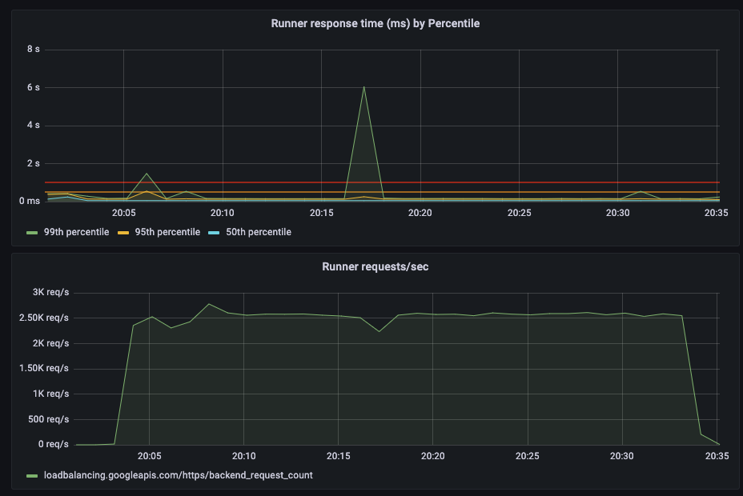

# Stress Test Phase 4 February 2022

To test deployment of a new version of eQ runner whilst under load.

The test was conducted 3 times, one trial run in a separate GCP project before 2 tests using eq-stress-test-340815. The trial results have been included to highlight a potential issue with latency on deployment.

In each test, runner version 3.9.4 was upgraded to 3.9.5. The only exception was the last test which was downgraded from 3.9.5 to 3.9.4, this seemed a completely valid scenario and due to no breaking changes in the versions had no ill effect.

## Runner settings

| Setting | Value |
| --- | ---| 
| Concurrency | 115 |
| Max instances   | 50 |
| Min instances | 25 |
| CPU | 4 |
| Memory | 4G |
| Version | 3.94.0 <-> 3.95.0|

## Benchmark settings

| Setting | Value |
| --- | ---| 
| Clients per instance | 100 |
| Clients hatch rate   | 50 |
| Wait time minimum | 1 |
| Wait time maximum | 2 |
| Requests JSON | test_benchmark_business.json |
| Runtime | 30m |
| Load injectors | 22 |

## Initial Benchmark

Prior to the test a benchmark was run to confirm the setup of eq-stress-test was relative to previous tests. The 99th Percentile was quicker than expected at 157ms, but was inside an acceptable range. A small number of 404s were recorded during the initial test (8 in 3 million requests) but were not investigated further.

| Stress Test |Runner Concurrency |Runner Instances | Run Time| Clients per instance | Requests per second | 99th percentile Max CPU Usage (%) | 99th percentile response time (ms) | Error rate (%) | Output |
| --- | --- | --- | --- |--- | --- | --- | --- | --- | --- |
| benchmark | 115 | 1 | 20 mins | 100  | 2.5k | 80  | 157 | 0.000 | [output](https://console.cloud.google.com/storage/browser/eq-stress-injector-07122021-outputs/stress-test/2022-02-09T19:23:30/) |

## Results

Deployment of eQ runner took approximately 2 minutes in total, but it was the creation of the revision and the switching which was a surprise taking seconds from appearing to having 100% traffic.

Deployment was successful each time with no associated errors (there were a handful of secrets already existing, but I saw that as a separate issue).

Although deployment was successful in each test it was not completely seemless. Each test saw a spike in latency of the new instance at the time of switching, this lasted approximately 20 seconds.

The table below shows the amount of requests in that time period and the count of requests breaking particular thresholds.

| Environment | Total requests | latency >2s |latency >5s | latency >10s | Date/Time | Output |
| --- | --- | --- | --- |--- | --- | --- |
| eq-stress-test-340815 (Test1) | 45,034 | 6017 | 3094 | 58 | 09-02-2022 20:00 |[output](https://console.cloud.google.com/storage/browser/eq-stress-injector-07122021-outputs/stress-test/2022-02-09T20:00:45/) |
| eq-stress-test-340815 (Test2) | 43,885 | 7540 | 5453 | 771 | 2022-02-10 13:18:38 |[output](https://console.cloud.google.com/storage/browser/eq-stress-injector-07122021-outputs/stress-test/2022-02-10T13:18:38/) |
| Trail run | 45,059 | 7443 | 3385 | 228 | 2022-02-09 13:14:03 | ephemeral GCP project |

## Visualisations

Test1

Test2

Trial

## Conclusion
Whether it was the test settings or the timeliness of the instance switching there does seem to be a gap lasting approximately 20 seconds when the new instance has significantly higher latency.

The results of the test showed that 15% of requests at the time were above 2 seconds. In 2 of the tests aftershocks were also seen for the next 2-3 minutes, where a small proportion of requests also took greater than 2 seconds (approximately 50 requests)

## Next Steps

- Investigate the reason behind the short term latency increase.